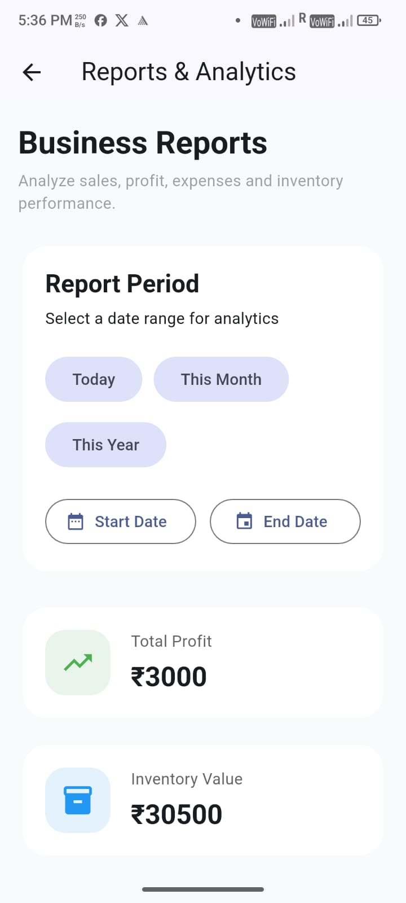
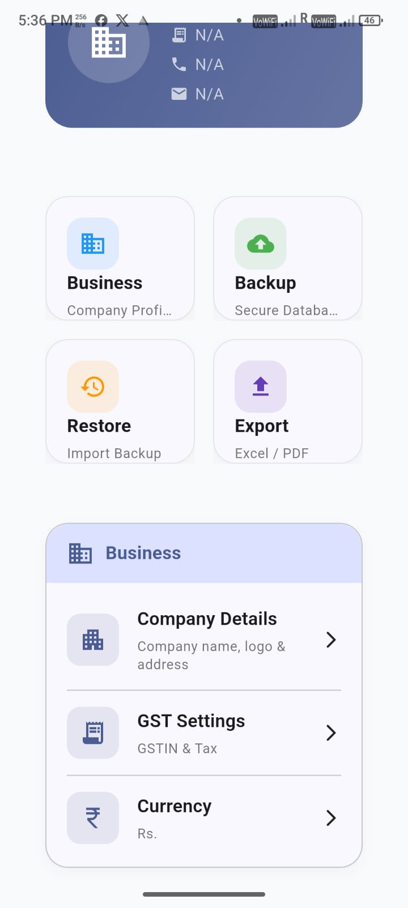
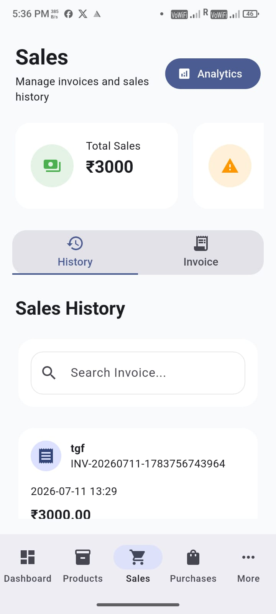
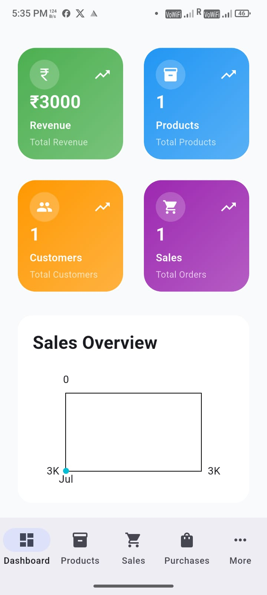
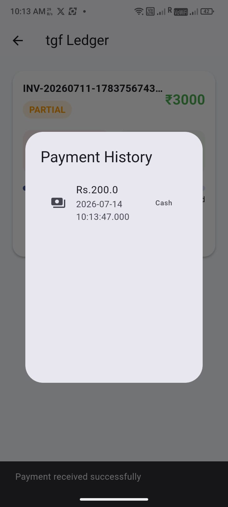
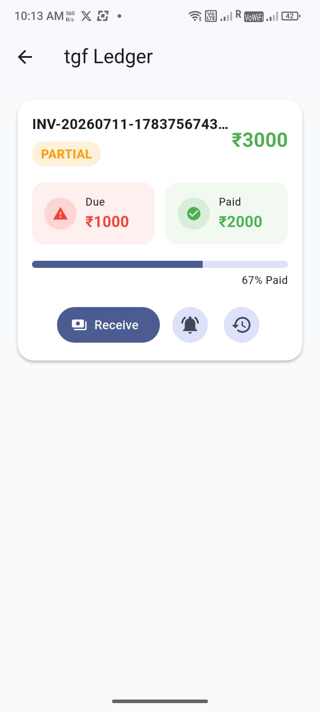
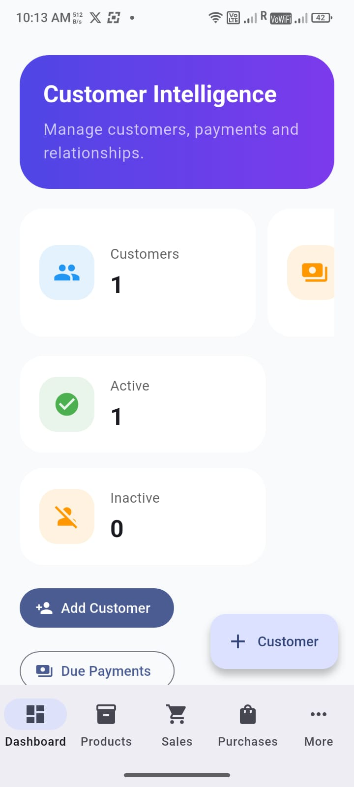
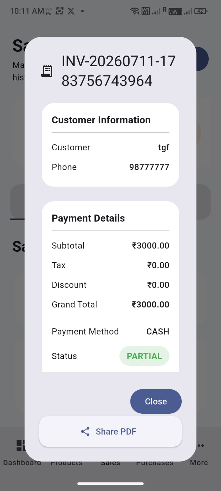
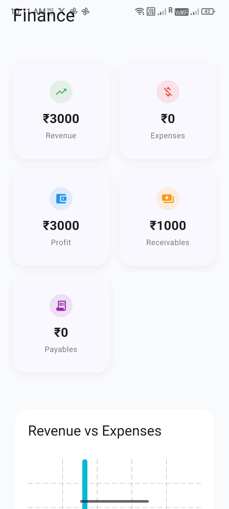

📱 Inventory ERP

A modern Flutter-based Inventory ERP application built for Desktop, Mobile, and Web. The application helps businesses manage customers, suppliers, products, invoices, purchases, payments, reports, and business settings from a single platform.

# Application Screenshots

    

    

    

 

✨ Features

Dashboard

- Business overview
- Quick statistics
- Recent activities

Customer Management

- Add, edit, delete customers
- Customer search
- Customer payment history
- Customer ledger
- Outstanding balance tracking

Supplier Management

- Add and manage suppliers
- Purchase history
- Supplier payment tracking

Product Management

- Product categories
- Product inventory
- Pricing management
- Stock updates

Purchase Management

- Create purchase invoices
- Purchase history
- Supplier-wise purchases

Sales & Invoices

- Create professional invoices
- Edit invoices
- Print invoices
- PDF invoice generation
- Invoice history

Payment Management

- Customer payments
- Supplier payments
- Payment history
- Balance calculations

Reports

- Sales Report
- Purchase Report
- Customer Report
- Supplier Report
- Payment Report
- Stock Report

Settings

- Company information
- Invoice configuration
- Business settings

Sun Module

- Dedicated Sun module integration
- Independent navigation
- Modular architecture for future expansion

---

🏗 Architecture

The project follows a clean and scalable architecture.

Presentation
│
State Management (Riverpod)
│
Repository
│
Drift Database

Technologies Used

- Flutter
- Dart
- Riverpod
- Drift (SQLite)
- Material 3
- PDF
- Printing
- Responsive UI

---

📂 Project Structure

lib/
├── core/
├── data/
│    ├── database/
│    ├── providers/
│    └── repositories/
├── features/
│    ├── dashboard/
│    ├── customers/
│    ├── suppliers/
│    ├── products/
│    ├── purchases/
│    ├── invoices/
│    ├── reports/
│    ├── settings/
│    └── sun/
├── shared/
└── main.dart

---

🚀 Implemented Highlights

- Responsive Desktop UI
- Mobile-friendly layouts
- Web support
- Riverpod state management
- Drift local database
- Customer payment tracking
- Supplier payment tracking
- Invoice PDF generation
- Search and filtering
- Modular feature structure
- Reusable widgets
- Form validation
- Business settings
- Sun module integration

---

📦 Packages

- flutter_riverpod
- drift
- sqlite3
- pdf
- printing
- intl
- path_provider

---

🎯 Future Enhancements

- Cloud synchronization
- Local network synchronization
- Barcode scanning
- QR code support
- User authentication
- Backup & Restore
- Dark mode
- Multi-language support
- Notifications
- Analytics dashboard

---

💻 Getting Started

1. Clone the repository.
2. Run:

flutter pub get

3. Generate Drift files:

dart run build_runner build --delete-conflicting-outputs

4. Run the application:

flutter run

---

📄 License

This project is intended for educational and commercial use as permitted by the repository owner.

---

👨‍💻 Author

Sunil Dholpuria

Senior Mobile Application Developer

- Flutter
- Android (Kotlin/Java)
- Riverpod
- Drift
- Clean Architecture
- Mobile & Desktop Application Development
